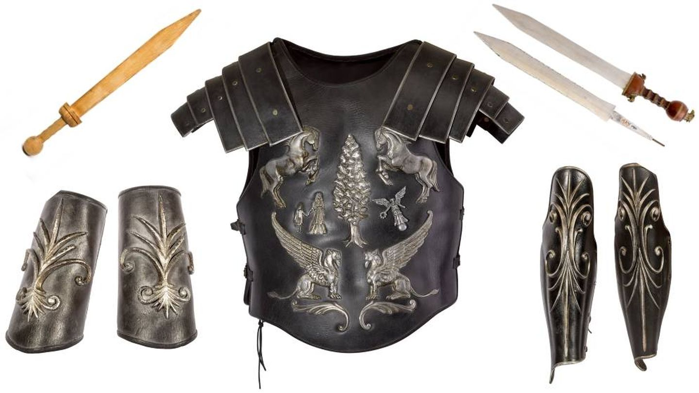
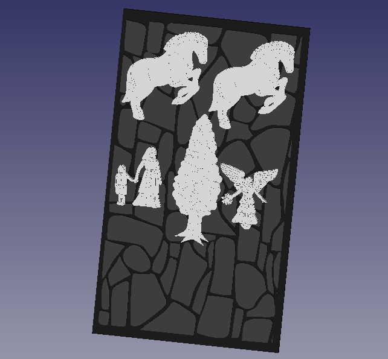
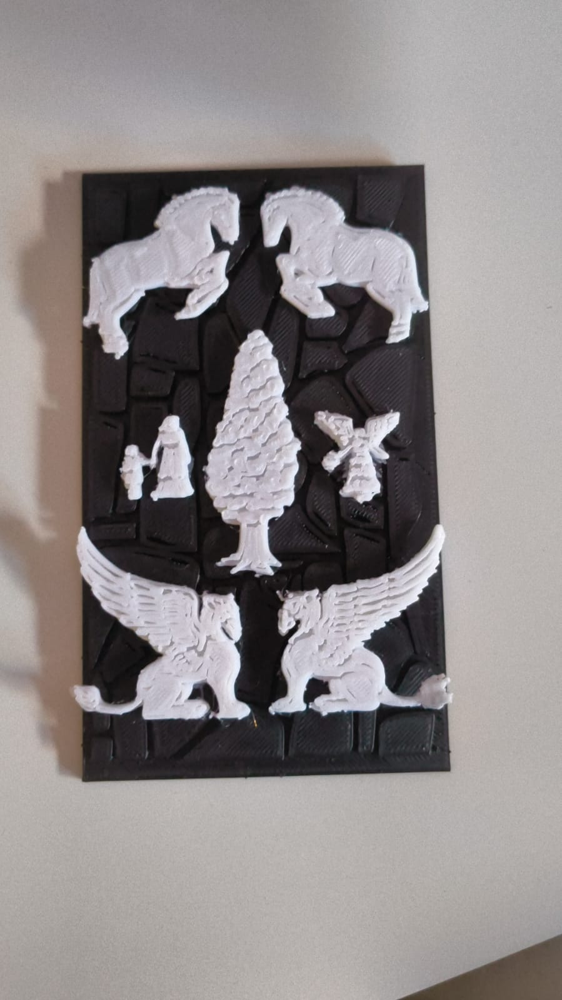

# Designing the "Gatortitas" Plushie in FreeCAD 🧸

This project aimed to replicate the "Gatortitas" plushie using FreeCAD. The design focuses on recreating the plushie's distinctive layered pancake structure, adorable facial features, and ears. The result captures the essence of the plushie while utilizing FreeCAD's 3D modeling tools effectively.

The original photography of the plushie is the following:

    

## Step 1: Creating the Pancake Layers 🥞
The three pancake layers were modeled using **cylinders** with rounded edges to replicate the soft, stacked appearance.

### Steps:
1. **Draw a Base Cylinder:**
   - Use the **Part Workbench** to create a cylinder for the bottom pancake layer.
   - Set the cylinder's radius and height to match the plushie's proportions.
2. **Round the Edges:**
   - Apply a **Fillet Tool** to round the top and bottom edges of the cylinder, giving it a soft, cushion-like appearance.
3. **Duplicate for Additional Layers:**
   - Duplicate the first cylinder twice using `Ctrl+C` and `Ctrl+V` to create the middle and top pancake layers.
   - Adjust the height and position of each layer to stack them properly.
4. **Add the Syrup Lines:**
   - Use the **Part Design Workbench** to create thin rings around each pancake layer to simulate the syrup stripes.
   - Position these rings and color them a darker brown for realism.

    

## Step 2: Modeling the Ears 🐱
The plushie's ears were modeled using a **cone** cut with a cube to shape the base.

### Steps:
1. **Create a Cone:**
   - Use the **Part Workbench** to create a cone for the ear.
   - Set the base radius and height to approximate the plushie's ear size.
2. **Cut the Cone:**
   - Position a cube at the base of the cone, intersecting it where the ear should connect to the head.
   - Use the **Boolean Difference Tool** to cut the cone and flatten its base.
3. **Duplicate the Ear:**
   - Duplicate the ear and mirror it using the **Placement Tool** to position it symmetrically on the other side.

    

## Step 3: Adding the Facial Features
The plushie's face includes eyes, a mouth, and a nose, modeled using cylinders and an SVG import.

### Steps:
1. **Eyes:**
   - Create two small cylinders for the eyes.
   - Adjust the radius to match the desired size and position them symmetrically on the front pancake.
2. **Mouth (SVG Import):**
   - In Inkscape, draw the plushie's mouth as an SVG.
   - Import the SVG into FreeCAD using the **Import Tool**.
   - Position and scale the mouth on the front pancake layer.
3. **Nose:**
   - Use a small circle from the **Sketcher Workbench** or a tiny cylinder to create the nose and align it between the eyes and mouth.

    

## Step 4: Refining the Model 🎨
### Steps:
1. **Coloring the Model:**
   - Assign materials or colors to each component using the **Appearance Tool**.
   - Set the pancakes to a light beige color and the syrup stripes to brown.
   - Color the facial features and ears appropriately (e.g., black for eyes, pink for nose).
2. **Smoothing:**
   - Apply additional fillets or smoothing tools to ensure the design looks soft and plush-like.
3. **Layer Management:**
   - Organize the layers into groups (e.g., "Pancakes," "Facial Features") for easier management and adjustments.

The final model successfully replicates the "Gatortitas" plushie, showcasing the power of constructive geometry and FreeCAD’s modeling tools.

    

---

# Designing a "Gladiator"-Inspired Mural in FreeCAD 🛡️

This project recreates the intricate figures from the movie *Gladiator*'s iconic armor, transformed into a mural for 3D printing. The design combines a custom-made wall created in Inkscape, STL models representing the armor figures, and FreeCAD for assembly. Finally, the mural was prepared for printing using CuraMaker.

    

## Step 1: Designing the Wall in Inkscape 🧱
1. **Create the Wall Base:**
   - Open Inkscape and draw a large rectangle to represent the wall’s dimensions.
   - Divide the rectangle into irregular sections to simulate stone patterns using the **Bezier Tool**.
   - Use **Path > Combine** to merge the sections into a single wall structure.
   - Fill the wall pattern with a dark gray color to resemble stone.

2. **Export as SVG:**
   - Save the completed wall design as an SVG file for later use in FreeCAD.

## Step 2: Importing Figures and Aligning Them in FreeCAD 🏇
### Importing the Wall:
1. **Load the SVG File:**
   - Open FreeCAD and use the **Draft Workbench** to import the SVG of the wall.
   - Extrude the SVG into a 3D object using the **Part Workbench**'s **Extrude Tool**, giving it a slight thickness.

### Importing Figures:
1. **Find STL Models:**
   - Download STL files of relevant figures (e.g., horses, the tree, the angel, and the woman and child) from free 3D model repositories.
2. **Import into FreeCAD:**
   - Use the **File > Import** option to bring each STL model into the FreeCAD workspace.
3. **Scale and Position Models:**
   - Adjust the size of each model using the **Transform Tool** to ensure they fit proportionally on the wall.
   - Place the models on top of the extruded wall, aligning them carefully to create a cohesive design.

    

## Step 3: Preparing the Mural for Printing 🖨️
### Merging Elements:
1. **Combine Figures and Wall:**
   - Use the **Boolean Union Tool** in the **Part Workbench** to merge the wall and the STL figures into a single printable object.

### Exporting for CuraMaker:
1. **Export the Final Model:**
   - Save the combined 3D model as an STL file for slicing.
2. **Load into CuraMaker:**
   - Open the STL in CuraMaker and position it on the virtual build plate.
   - Adjust print settings such as:
     - **Layer Height:** 0.2 mm for detailed printing.
     - **Infill Density:** 20-30% for structural stability.
     - **Support Structures:** Enable support for overhanging parts of the figures.

## Step 4: Printing the Mural ✨
1. **Start the Print:**
   - Send the prepared file to the 3D printer and monitor the printing process.
2. **Post-Processing:**
   - Remove any support structures and sand rough edges to ensure a smooth finish.
   - Optionally, paint the mural for added visual effect.

    

### Summary of Tools and Techniques:

| Tool/Feature              | Purpose                                | Example Use                  |
|---------------------------|----------------------------------------|------------------------------|
| Inkscape                  | Create the wall design                 | Stone-like wall pattern      |
| FreeCAD Extrude Tool      | Turn 2D SVG into a 3D object           | Wall base                    |
| STL Import                | Add 3D figures to the design           | Horses, angel, tree, etc.    |
| Boolean Union Tool        | Merge all elements into a single model | Wall and figures             |
| CuraMaker                 | Prepare the file for 3D printing       | Slice and adjust settings    |

The result is a stunning 3D-printed mural that combines artistic elements from *Gladiator* with the precision of CAD and 3D printing tools. 

    

