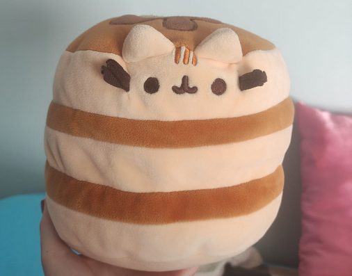
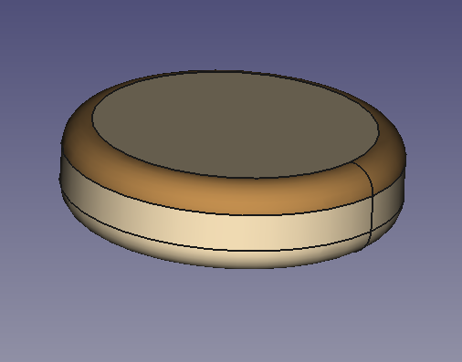
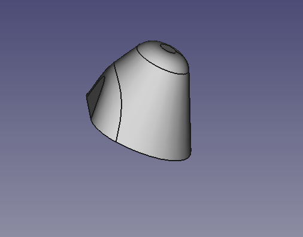
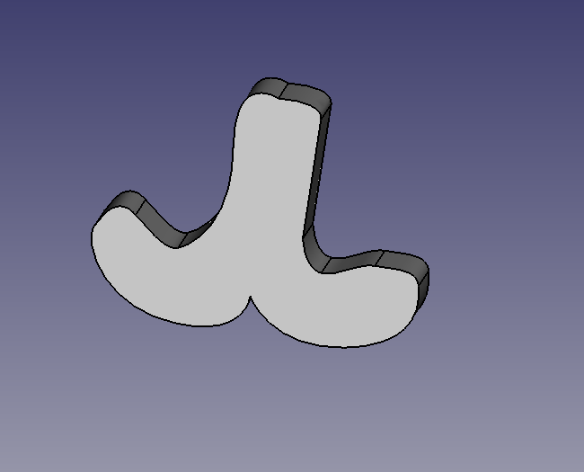
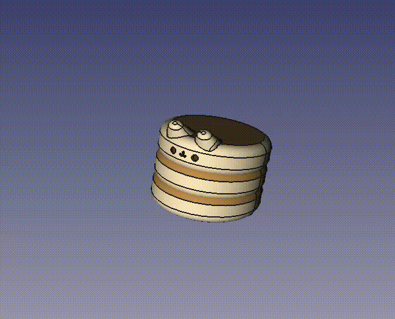

# Designing the "Gatortitas" Plushie in FreeCAD 🧸

This project aimed to replicate the "Gatortitas" plushie using FreeCAD. The design focuses on recreating the plushie's distinctive layered pancake structure, adorable facial features, and ears. The result captures the essence of the plushie while utilizing FreeCAD's 3D modeling tools effectively.

The original photography of the plushie is the following:

    

## Step 1: Creating the Pancake Layers 🥞
The three pancake layers were modeled using **cylinders** with rounded edges to replicate the soft, stacked appearance.

### Steps:
1. **Draw a Base Cylinder:**
   - Use the **Part Workbench** to create a cylinder for the bottom pancake layer.
   - Set the cylinder's radius and height to match the plushie's proportions.
2. **Round the Edges:**
   - Apply a **Fillet Tool** to round the top and bottom edges of the cylinder, giving it a soft, cushion-like appearance.
3. **Duplicate for Additional Layers:**
   - Duplicate the first cylinder twice using `Ctrl+C` and `Ctrl+V` to create the middle and top pancake layers.
   - Adjust the height and position of each layer to stack them properly.
4. **Add the Syrup Lines:**
   - Use the **Part Design Workbench** to create thin rings around each pancake layer to simulate the syrup stripes.
   - Position these rings and color them a darker brown for realism.

    

## Step 2: Modeling the Ears 🐱
The plushie's ears were modeled using a **cone** cut with a cube to shape the base.

### Steps:
1. **Create a Cone:**
   - Use the **Part Workbench** to create a cone for the ear.
   - Set the base radius and height to approximate the plushie's ear size.
2. **Cut the Cone:**
   - Position a cube at the base of the cone, intersecting it where the ear should connect to the head.
   - Use the **Boolean Difference Tool** to cut the cone and flatten its base.
3. **Duplicate the Ear:**
   - Duplicate the ear and mirror it using the **Placement Tool** to position it symmetrically on the other side.

    

## Step 3: Adding the Facial Features
The plushie's face includes eyes, a mouth, and a nose, modeled using cylinders and an SVG import.

### Steps:
1. **Eyes:**
   - Create two small cylinders for the eyes.
   - Adjust the radius to match the desired size and position them symmetrically on the front pancake.
2. **Mouth (SVG Import):**
   - In Inkscape, draw the plushie's mouth as an SVG.
   - Import the SVG into FreeCAD using the **Import Tool**.
   - Position and scale the mouth on the front pancake layer.
3. **Nose:**
   - Use a small circle from the **Sketcher Workbench** or a tiny cylinder to create the nose and align it between the eyes and mouth.

    

## Step 4: Refining the Model 🎨
### Steps:
1. **Coloring the Model:**
   - Assign materials or colors to each component using the **Appearance Tool**.
   - Set the pancakes to a light beige color and the syrup stripes to brown.
   - Color the facial features and ears appropriately (e.g., black for eyes, pink for nose).
2. **Smoothing:**
   - Apply additional fillets or smoothing tools to ensure the design looks soft and plush-like.
3. **Layer Management:**
   - Organize the layers into groups (e.g., "Pancakes," "Facial Features") for easier management and adjustments.

The final model successfully replicates the "Gatortitas" plushie, showcasing the power of constructive geometry and FreeCAD’s modeling tools.

    

---

