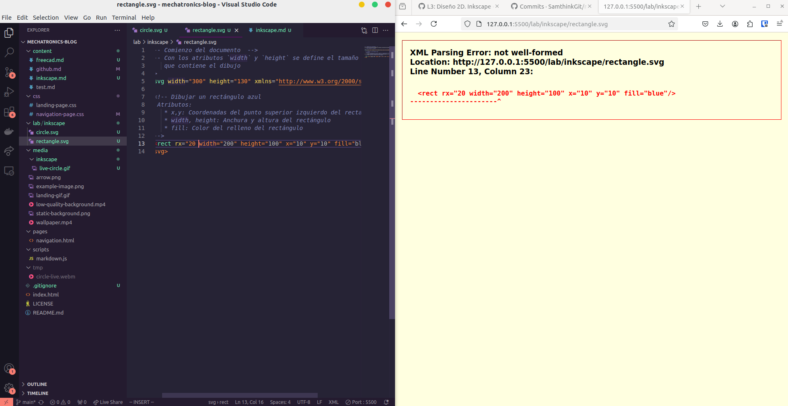

# Learning SVG

## My First Figure
Today, I created my very first SVG circle using a simple script from a tutorial:

```html
<svg viewBox="0 0 20 20" xmlns="http://www.w3.org/2000/svg">
    <title>Basic SVG Structure</title>
    <style>
        .circle {fill: blue}
    </style>
    <circle class="circle" cx="5" cy="5" r="5" />
</svg>
```

This script establishes the fundamental structure of an SVG file. It uses a `viewBox` attribute to define the canvas size, styles to color the circle blue, and the `<circle>` tag to draw a circle with specific attributes such as its center (`cx`, `cy`) and radius (`r`). 🟦 By modifying these attributes, I can easily adjust the size and position of the circle within the SVG canvas.

---

## Trick: Real-Time SVG Editing 🛠️
After creating the circle, I explored how to preview and edit SVGs in real-time. This dramatically improves workflow efficiency and makes the design process far more interactive and enjoyable. Here's a detailed breakdown of the steps involved:

1. **Install VS Code LiveServer Extension:**
   - Download and activate the LiveServer extension from the VS Code marketplace.
   - This tool effectively transforms your local project into a web server, allowing dynamic file updates.

2. **Set Up a Live Server:**
   - Open the root folder of the project in VS Code.
   - Right-click on `index.html` (or any file in the folder) and select "Open with Live Server."
   - Navigate to `http://127.0.0.1:5500` in your browser to see your project live.

3. **Edit SVGs in Real-Time:**
   - Open the SVG file via the browser interface.
   - Any changes saved in the editor are instantly reflected in the browser, enabling a professional editing workflow that feels almost seamless.

<div align="center">
    
</div>

### Error Debugging Feature 🚨
One unexpected benefit of this method is real-time syntax error detection. For example, if there is a typo in the SVG syntax, the browser immediately highlights the issue and even pinpoints its location. This can be a lifesaver during complex designs, as it eliminates the need for repetitive trial-and-error debugging. Here's an example of the error screen:

<div align="center">
    
</div>

Another advantage is that this method encourages experimentation. I found myself making small adjustments to attributes like `cx`, `cy`, or colors and seeing the results instantly, which enhanced my understanding of how different parameters interact.

---

## Designing Shapes
Building upon the initial example, I experimented with creating various shapes using SVG tutorials. These included:

- **Rectangle:** Defined by width and height attributes, rectangles are the foundation for many designs.
- **Line:** Simple linear paths connecting two points, great for creating guides or dividers.
- **Circle:** Already covered but invaluable for creating rounded elements.
- **Ellipse:** Like a circle but with independent x and y radii, offering more flexibility for designs.
- **Polygon:** A closed shape formed by connecting multiple points, perfect for creating stars or geometric patterns.
- **Polyline:** Similar to a polygon but does not close, often used for paths or abstract designs.
- **Text:** Render text directly within the SVG, with full styling capabilities such as font, size, and color.
- **Triangle:** A specific case of a polygon with three points, often used for arrows or markers.
- **Simple Animations:** Added movement and interaction to elements, making the designs more dynamic and engaging.

### Example SVG Combining All Elements 🌟
To consolidate these skills, I designed a composite SVG combining all these elements into a cohesive design. This exercise was a significant milestone as it allowed me to apply everything I learned in a single project:

<div align="center">
    
</div>

### Reflection
Exploring these elements demonstrated the versatility of SVGs in creating scalable and interactive graphics. Each shape is straightforward yet powerful, especially when animations are introduced to bring designs to life. The fact that these graphics can scale without losing quality is particularly useful for modern web design. Additionally, the ability to style and animate directly within the SVG code saves the hassle of external dependencies.

---

## Next Steps: Inkscape 🎨
To further enhance my SVG skills, I will explore Inkscape in the next session. This tool offers a user-friendly interface for crafting intricate SVG designs. It bridges the gap between code-based and visual design approaches, making it ideal for both beginners and advanced users.