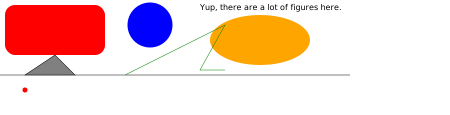
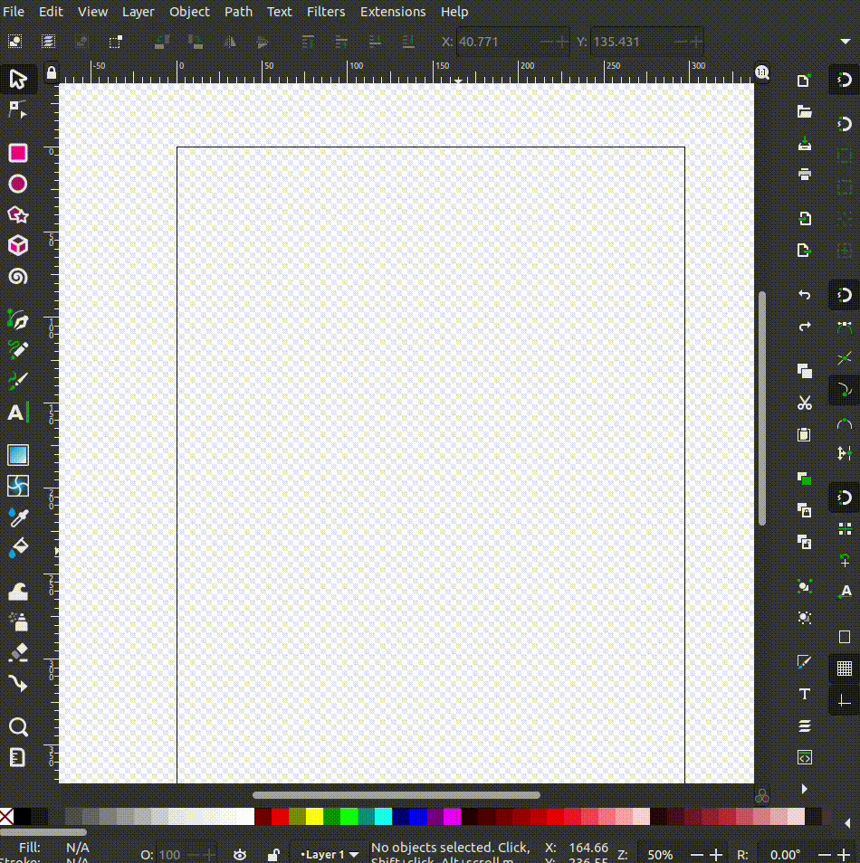
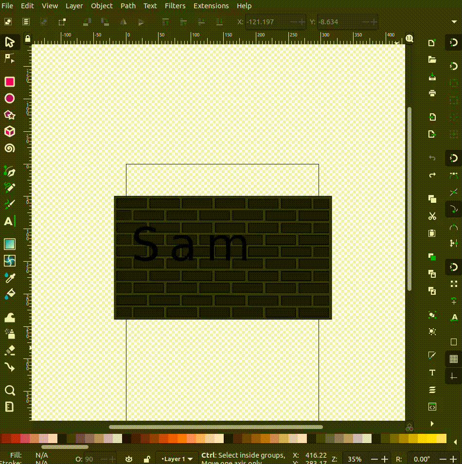

# Learning SVG

## My First Figure
Today, I created my very first SVG circle using a simple script from a tutorial:

```html
<svg viewBox="0 0 20 20" xmlns="http://www.w3.org/2000/svg">
    <title>Basic SVG Structure</title>
    <style>
        .circle {fill: blue}
    </style>
    <circle class="circle" cx="5" cy="5" r="5" />
</svg>
```

This script establishes the fundamental structure of an SVG file. It uses a `viewBox` attribute to define the canvas size, styles to color the circle blue, and the `<circle>` tag to draw a circle with specific attributes such as its center (`cx`, `cy`) and radius (`r`). 🟦 By modifying these attributes, I can easily adjust the size and position of the circle within the SVG canvas.

---

## Trick: Real-Time SVG Editing 🛠️
After creating the circle, I explored how to preview and edit SVGs in real-time. This dramatically improves workflow efficiency and makes the design process far more interactive and enjoyable. Here's a detailed breakdown of the steps involved:

1. **Install VS Code LiveServer Extension:**
   - Download and activate the LiveServer extension from the VS Code marketplace.
   - This tool effectively transforms your local project into a web server, allowing dynamic file updates.

2. **Set Up a Live Server:**
   - Open the root folder of the project in VS Code.
   - Right-click on `index.html` (or any file in the folder) and select "Open with Live Server."
   - Navigate to `http://127.0.0.1:5500` in your browser to see your project live.

3. **Edit SVGs in Real-Time:**
   - Open the SVG file via the browser interface.
   - Any changes saved in the editor are instantly reflected in the browser, enabling a professional editing workflow that feels almost seamless.

<div align="center">
    
</div>

### Error Debugging Feature 🚨
One unexpected benefit of this method is real-time syntax error detection. For example, if there is a typo in the SVG syntax, the browser immediately highlights the issue and even pinpoints its location. This can be a lifesaver during complex designs, as it eliminates the need for repetitive trial-and-error debugging. Here's an example of the error screen:

<div align="center">
    
</div>

Another advantage is that this method encourages experimentation. I found myself making small adjustments to attributes like `cx`, `cy`, or colors and seeing the results instantly, which enhanced my understanding of how different parameters interact.

---

## Designing Shapes
Building upon the initial example, I experimented with creating various shapes using SVG tutorials. These included:

- **Rectangle:** Defined by width and height attributes, rectangles are the foundation for many designs.
- **Line:** Simple linear paths connecting two points, great for creating guides or dividers.
- **Circle:** Already covered but invaluable for creating rounded elements.
- **Ellipse:** Like a circle but with independent x and y radii, offering more flexibility for designs.
- **Polygon:** A closed shape formed by connecting multiple points, perfect for creating stars or geometric patterns.
- **Polyline:** Similar to a polygon but does not close, often used for paths or abstract designs.
- **Text:** Render text directly within the SVG, with full styling capabilities such as font, size, and color.
- **Triangle:** A specific case of a polygon with three points, often used for arrows or markers.
- **Simple Animations:** Added movement and interaction to elements, making the designs more dynamic and engaging.

### Example SVG Combining All Elements 🌟
To consolidate these skills, I designed a composite SVG combining all these elements into a cohesive design. This exercise was a significant milestone as it allowed me to apply everything I learned in a single project:

<div align="center">
    
</div>

### Reflection
Exploring these elements demonstrated the versatility of SVGs in creating scalable and interactive graphics. Each shape is straightforward yet powerful, especially when animations are introduced to bring designs to life. The fact that these graphics can scale without losing quality is particularly useful for modern web design. Additionally, the ability to style and animate directly within the SVG code saves the hassle of external dependencies.

---
# Next Steps: Inkscape 🎨

## Initial Setup and Configuration ⚙️
Before diving into artistic designs with Inkscape, it is essential to configure the environment for an optimal experience. This involves adjusting the general theme and background colors to reduce eye strain and improve focus. Configurations like these not only enhance usability but also create a visually appealing workspace that fosters creativity.

- **Background Color Adjustment:** A neutral background helps to better visualize the contrast of designs.
- **Theme Configuration:** Switching to a dark theme can reduce eye strain during prolonged sessions.

With the setup complete, I began exploring the basics of drawing in Inkscape.

---

## Learning Basic Shapes: Creating a Square 🟥
The first step in the tutorial focused on creating a square, the most fundamental shape. Using the **Rectangle Tool**, I drew a simple square by dragging the cursor while holding the Shift key to ensure proportional dimensions.

### Why the Rectangle Tool?
The Rectangle Tool is versatile for creating shapes of varying dimensions. It also includes features to adjust corners for rounded edges, adding more flexibility to the designs.

Below is a demonstration of how to create your first square:

<div align="center">
    
</div>

This exercise helped me understand how to manipulate basic shapes and prepare for more complex designs.

---

## My First Professional Drawing 🤖
Building on the basics, I designed my first professional drawing: a robot. This exercise involved only the **Rectangle Tool** and color fills, showcasing the power of simplicity in design.

### Steps to Create the Robot:
1. **Feet and Legs:**
   - Use small rectangles for the feet and legs.
   - Arrange them symmetrically for a balanced design.
2. **Semi-Circular Body:**
   - Stack rectangles and align them to form a semi-circle effect.
3. **Eyes and Highlights:**
   - Two rectangles for the eyes.
   - Smaller rectangles inside the eyes for highlights, giving a "cute" effect.
4. **Coloring and Gradients:**
   - Use the default color palette to create a sense of depth by adding shadows to some rectangles.

By carefully placing these elements and experimenting with colors, I created a pixel-art-style robot. The final result is shown below:

<div align="center">
    
</div>

---

## Reusing the Drawing: Creating a Robot Group 🤖🤖🤖
With the robot completed, I explored tools like **Duplication**, **Translation**, **Deformation**, and **Rotation** to enhance the design.

### Steps to Create the Robot Group:
1. **Duplication:**
   - Use Ctrl+D to duplicate the robot multiple times.
   - Arrange the duplicates in a circular pattern.
2. **Deformation and Translation:**
   - Adjust the size and position of each robot to create a dynamic layout.
3. **Rotating the Sky Robot:**
   - Rotate one robot to appear as though it is "jumping" into the air.
4. **Adding Movement Lines:**
   - Draw rectangles as motion lines to simulate movement.
   - Rotate the lines to align with the direction of motion.

These techniques resulted in a dynamic scene, as shown below:

<div align="center">
    
</div>

### Reflection:
The duplication and translation tools made it easy to create complex designs quickly. This exercise also demonstrated the importance of layering and positioning to create visually engaging compositions.

---

## Refining the Drawing: Adding Polish ✨
With the foundational design completed, I refined the robot using advanced tools like **Stroke**, **Blur**, and **Rounding Corners** for a polished look.

### Enhancements:
1. **Rounding Edges:**
   - Applied rounded corners to the eyes and feet for a softer, more appealing look.
2. **Adding Shadows:**
   - Used shadows to create smoother color transitions, giving the robot a cartoon-like appearance.
3. **Eye Flares:**
   - Created small circles in the eyes with a slight blur effect to add a "cute" sparkle.

These refinements transformed the robot into a more detailed and professional-looking design. The result is displayed below:

<div align="center">
    
</div>

---

## Summary Table of Tools and Techniques 🛠️
To summarize the tools and their applications:

| Tool/Feature          | Purpose                              | Example Use              |
|-----------------------|--------------------------------------|--------------------------|
| Rectangle Tool        | Create basic shapes                 | Robot body, legs         |
| Duplication           | Replicate elements                  | Multiple robots          |
| Translation           | Adjust position of elements         | Arranging robots         |
| Deformation/Rotation  | Alter size and angle of elements     | Sky robot and motion     |
| Stroke and Blur       | Add polish and soft transitions      | Shadows and eye flares   |

---

# Pac-Man Design in Inkscape 🎨

## Initial Setup ⚙️
For practicing the tools learnt in the following seciont we will try to draw a beauty Pacman. Before starting the Pac-Man design, it's important to prepare the workspace for precise and efficient editing:

1. **Canvas Size:** Adjust the document properties to a square size like 500x500 pixels, suitable for game-like designs.
2. **Background Color:** Set the background to black, matching the classic Pac-Man aesthetic.

### Tools Used:
- **Ellipse Tool:** For Pac-Man and the dots.
- **Arc Tool (Ellipse Modifier):** To create the "mouth" of Pac-Man.
- **Rectangle Tool:** For the blue bars.
- **Fill and Stroke:** To apply colors and adjust thickness.
- **Duplicate Tool:** To quickly copy repetitive elements.


## Step 1: Creating Pac-Man 🟡
Pac-Man is the centerpiece of the design, created using the Ellipse Tool with the Arc modification feature.

1. **Draw a Circle:**
   - Select the **Ellipse Tool** (`F5` shortcut).
   - Hold `Ctrl` while dragging to create a perfect circle.
   - Set the fill color to yellow.
2. **Create the Mouth:**
   - With the circle selected, use the **Arc Tool** feature available in the top toolbar.
   - Adjust the start and end angles to "cut" a triangular slice from the circle, forming the mouth.
3. **Add the Eye:**
   - Draw a small black circle using the **Ellipse Tool** and position it near the top of Pac-Man's head.


## Step 2: Adding the Dots ⚪
The dots represent the food path for Pac-Man.

1. **Create a Single Dot:**
   - Draw a small circle using the **Ellipse Tool**.
   - Set the fill color to yellow.
2. **Duplicate the Dot:**
   - Use `Ctrl+D` to duplicate the dot multiple times.
   - Use the **Align and Distribute** tool to space them evenly in a horizontal line.

### Tools Used:
- **Duplicate Tool:** For quick replication of elements.
- **Align and Distribute:** Ensures consistent spacing and alignment.


## Step 3: Drawing the Blue Bars 🔵
The horizontal blue bars provide structure to the scene and frame the Pac-Man design.

1. **Draw a Rectangle:**
   - Use the **Rectangle Tool** to create a horizontal bar.
   - Adjust the dimensions to match the width of the canvas while keeping a narrow height.
   - Set the fill color to blue and increase the stroke thickness for a bold appearance.
2. **Duplicate and Position:**
   - Duplicate the rectangle and place it symmetrically above and below the Pac-Man and dots.

### Final Result:
The design effectively captures the essence of the retro Pac-Man game, utilizing simple shapes and precise alignment to create a vibrant scene :D.


<div align="center">
    
</div>

---

# Sinusoidal Function Representation with Bezier Curves

In this section, we will try to replicacte the sinusoidal function `f(x, y) = sin(x)` using only the following tools and techniques:

- **Bezier Curves** for the sinusoidal waves.
- **Transparency** to simulate overlapping waves.
- **Text Tool** for labels and function description.
- **Rectangle Tool** for the axes.

---

## Step 1: Setting Up the Axes 📐
The axes serve as the foundation for the illustration:

1. **Draw the X-Axis:**
   - Use the **Rectangle Tool** to create a long, thin rectangle for the x-axis.
   - Adjust its stroke and fill to solid black.
   - Position it horizontally at the bottom of the canvas.
   - Add a label using the **Text Tool**, writing "x-Axis" and positioning it near the end of the axis.

2. **Draw the Y-Axis:**
   - Similarly, use the **Rectangle Tool** to create a vertical rectangle for the y-axis.
   - Position it at the left edge of the canvas.
   - Label it "Y-Axis" using the **Text Tool**.

---

## Step 2: Drawing the Sinusoidal Waves 🌊
Each wave represents a slice of the sinusoidal function, drawn using **Bezier Curves**:

1. **Create the First Wave:**
   - Select the **Bezier Curve Tool**.
   - Draw a sinusoidal path by clicking to define anchor points along the curve.
   - Adjust the curve handles to create smooth, flowing sine waves.

2. **Duplicate and Offset Waves:**
   - Duplicate the first curve using `Ctrl+D`.
   - Offset the duplicate vertically to create the illusion of multiple layers.
   - Repeat this step multiple times, ensuring the waves maintain consistent spacing.

3. **Add Transparency:**
   - Select each wave and adjust its transparency in the **Fill and Stroke** panel.
   - Assign a gradient fill to simulate depth and light interaction, fading from yellow to transparent.

---

## Step 3: Adding Shadows and Depth ✨
1. **Apply Drop Shadows:**
   - Select each wave and apply a drop shadow effect via the **Filters > Shadows and Glows > Drop Shadow** option.
   - Adjust the opacity, blur radius, and offset to create a subtle shadow effect.
   - This enhances the perception of overlapping waves.

2. **Refine the Shadowing:**
   - Ensure that shadows are consistent across all waves.
   - Adjust the transparency of shadows to prevent them from overwhelming the design.

---

## Step 4: Labeling the Function ✍️
**Write the Function Equation:**
   - Use the **Text Tool** to type the equation `f(x, y) = sin(x)`.
   - Position it centrally beneath the waves.

---

The final result is a visually appealing representation of the sinusoidal function, combining simplicity with professional design elements.


<div align="center">
    
</div>

---

# Simulating a Catan Board in Inkscape 🎲

## Overview
This simulation of a Catan board was created entirely in 2D using **basic geometric shapes** such as hexagons, rectangles, and circles. After assembling the elements, the design was transformed to appear three-dimensional using the Deform Tool. This approach creates a realistic perspective effect, giving the flat 2D board a dynamic and engaging appearance.

---

## Step 1: Designing the Hexagonal Tiles 🛠️
The hexagonal tiles form the core of the Catan board. Each hexagon represents a resource type (e.g., wood, brick, wheat).

1. **Creating a Hexagon:**
   - Use the **Polygon Tool** and set the sides to six to draw a perfect hexagon.
   - Hold `Ctrl` while dragging to ensure alignment and symmetry.
   - Resize the hexagon to the desired tile size.
2. **Assigning Colors:**
   - Fill each hexagon with a different color to represent resources (e.g., green for wood, red for brick).
   - Use the **Fill and Stroke** panel to adjust the colors and remove any unnecessary strokes.
3. **Arranging the Tiles:**
   - Duplicate the hexagon using `Ctrl+D`.
   - Align the hexagons in a honeycomb pattern using the **Align and Distribute** tool to ensure consistent spacing.

---

## Step 2: Adding Other Board Elements 🧩
Additional components, such as the score trackers, player areas, and resource cards, were created using rectangles and circles.

1. **Score Trackers:**
   - Use the **Rectangle Tool** to create elongated rectangles representing score trackers.
   - Duplicate and align these trackers on one side of the board.
2. **Player Areas:**
   - Draw rectangles for the player areas and assign distinct colors to differentiate them.
3. **Resource Cards:**
   - Use small rectangles to represent the resource cards and arrange them near the board's edges for easy access.
4. **Dice and Number Tokens:**
   - Use the **Ellipse Tool** to create circles for the number tokens (placed on hex tiles).
   - Label the tokens with numbers using the **Text Tool**.

---

## Step 3: Applying 3D Perspective 🌟
To give the 2D board a realistic 3D appearance:

1. **Select the Entire Design:**
   - Group all elements of the board (hexagons, trackers, and tokens) using `Ctrl+G`.
2. **Deform Tool:**
   - Navigate to **Path > Object to Path** to convert the grouped elements into a path.
   - Use the **Deform Tool** (or Perspective Tool) to skew the grouped design.
   - Adjust the handles to simulate a tilted perspective, making the board look like it’s lying on a table.

---

## Result ✨

The result is a 2D Catan board transformed into a dynamic 3D simulation, demonstrating the versatility of basic tools combined with perspective adjustments.

<div align="center">
    
</div>

---

# Creating a Neon Sign Effect in Inkscape ✨
In this section, we will try to create a neon sign effect designed to simulate a glowing text overlay on a brick wall. The following tools and techniques were used:

- **Text Tool** for creating the main text.
- **Blur and Glow Effects** for the neon glow.
- **Star Shape** to add colorful "light splashes."
- **Burned Effect** to simulate color bleeding on the wall.

---

## Step 1: Creating the Text ✍️
The text "Sam" serves as the focal point of the design.

1. **Add the Text:**
   - Use the **Text Tool** (`T` shortcut) to type "Sam."
   - Choose a bold, sans-serif font for a modern neon look.
   - Set the initial fill color to yellow for a bright, glowing effect.
2. **Apply Stroke:**
   - Add an outline using the **Fill and Stroke** panel.
   - Use a slightly darker yellow for the stroke to create depth.

---

## Step 2: Adding the Glow ✨
To simulate the neon glow, blurring techniques were applied to the text.

1. **Duplicate the Text:**
   - Create a duplicate of the original text (`Ctrl+D`).
   - Place the duplicate behind the original text.
2. **Apply Blur:**
   - Open the **Fill and Stroke** panel and increase the blur to create a glowing halo effect.
   - Adjust the opacity to make the glow softer and more natural.
3. **Add Gradient Glow:**
   - Use a radial gradient fill on the blurred text.
   - Transition from a bright yellow center to a transparent edge for a realistic glow.

---

## Step 3: Designing the Background 🧱
The brick wall provides a realistic backdrop for the neon sign.

1. **Create the Wall:**
   - Use the **Rectangle Tool** to draw a black rectangle as the base.
   - Add a **brick pattern** using the **Extensions > Render > Pattern > Bricks** feature.
   - Set the brick color to a dark gray for subtle texture.
2. **Color the Wall:**
   - Use the **Gradient Tool** to add subtle blue and purple lighting effects on the wall.
   - Blend the gradient with the brick texture for a cohesive look.

---

## Step 4: Adding Light Splashes 🌟
Light splashes enhance the ambiance by simulating reflected light on the wall.

1. **Create a Star Shape:**
   - Use the **Star Tool** to draw a simple star.
   - Adjust the corners to make it more symmetrical.
2. **Blur the Star:**
   - Apply a high blur value to the star using the **Fill and Stroke** panel.
   - This creates a soft, glowing splash of light.
3. **Add Colors:**
   - Use the **Color Picker Tool** to select vibrant colors (blue, purple, yellow).
   - Apply a radial gradient to each star to blend it naturally with the wall.
4. **Burn the Colors:**
   - Use the **Burn Tool** to smear the colors lightly onto the wall texture, simulating light bleeding.

---

## Final Touches ✨
1. **Frame the Design:**
   - Add a rounded rectangle around the text to give it a "signboard" look.
   - Apply a subtle white glow to the frame for emphasis.
2. **Layer Management:**
   - Separate elements into layers (text, glow, wall, light splashes) for easier adjustments.
3. **Polish the Effects:**
   - Adjust the transparency and blur of each element to ensure a balanced, cohesive look.


## Results
The final result combines vibrant colors, glowing effects, and a realistic textured background to create an immersive neon sign design.

<div align="center">
    
</div>