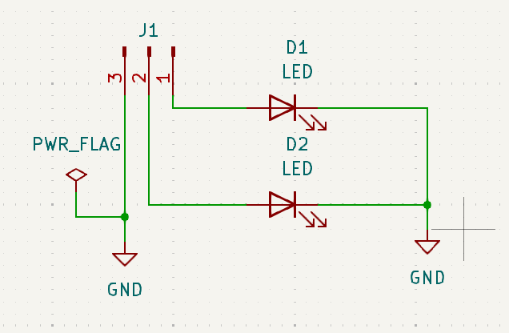
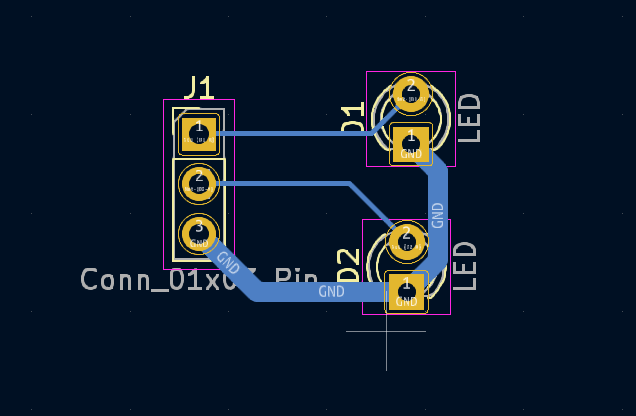
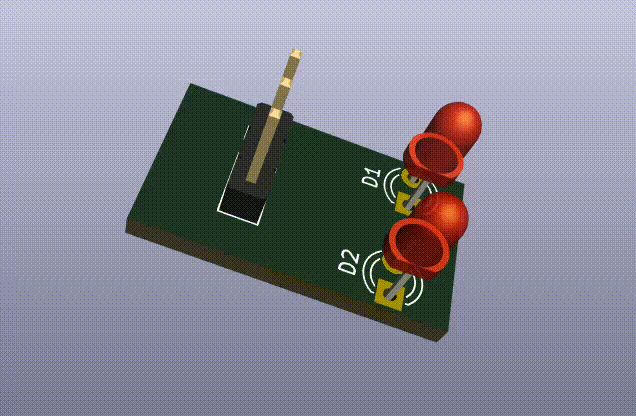

# Creating a Simple LED Circuit in KiCad 💡

This project demonstrates the process of designing a basic LED circuit in KiCad, from the schematic to the PCB layout and 3D visualization. The circuit includes two LEDs connected to a 3-pin connector.

## Step 1: Schematic Design ✍️
1. **Creating a New Project:**
   - Open KiCad and create a new project.
   - Name the project appropriately (e.g., `LED_Circuit`).

2. **Placing Components:**
   - Open the **Schematic Editor**.
   - Use the **Add Component Tool** to place the following components:
     - 2 LEDs (D1 and D2).
     - 1 3-pin connector (J1).
     - A ground symbol (`GND`).
     - A power flag (`PWR_FLAG`) to mark the power input.

3. **Connecting Components:**
   - Use the **Wire Tool** to connect the components as shown:
     - Pin 1 of the connector connects to the anode of D1.
     - Pin 2 connects to the anode of D2.
     - Cathodes of both LEDs are connected to ground.
   - Double-check connections to ensure the circuit is correct.

4. **Annotating the Schematic:**
   - Use the **Annotate Schematic** tool to assign unique identifiers to each component.

    

## Step 2: PCB Layout 🛠️
1. **Generate Netlist:**
   - Use the **Generate Netlist** tool to create a netlist for PCB design.

2. **Open PCB Editor:**
   - Open the **PCB Layout Editor**.
   - Import the netlist to place components on the board.

3. **Place Components:**
   - Arrange the components on the PCB according to the desired layout.
   - Ensure proper spacing between components.

4. **Route Traces:**
   - Use the **Route Tracks Tool** to connect pads according to the schematic.
   - Ensure that traces for signals and ground are properly routed.

    

## Step 3: 3D Visualization 🌐
1. **Open the 3D Viewer:**
   - Click the **3D Viewer** button in the PCB Editor.
   - View the board in 3D to verify component placement and overall design.

2. **Adjust Component Models:**
   - Assign 3D models to components if necessary to improve visualization.
   - Ensure that the models align with the footprints on the PCB.

    

The process described resulted in the schematic, PCB layout, and 3D model shown in the images, providing a complete design ready for manufacturing.

