# Designing Eva from Wall-E for a Mechatronics Project 🛠️

## Introduction
This document outlines the process of designing a 3D model of Eva from the movie *Wall-E*. The model is part of a semester-long mechatronics project, aimed at replicating Eva's iconic design for potential integration with robotics and automation. The design process will involve creating each part of Eva step-by-step using FreeCAD, starting with the head.

---

# Modeling Eva's Head in FreeCAD 🛠️

This section outlines how to model the head of Eva from *Wall-E* in FreeCAD using the **Sketcher** and **Part Design** workbenches. The head's round and smooth shape is created by sketching a profile and then using the Revolve tool to generate a 3D solid.

## Step 1: Drawing the Profile ✍️
The head's profile is drawn as a 2D cross-section of the shape that will be revolved.

1. **Create a New Sketch:**
   - Select the **XY Plane** as the sketching plane.
   - Click on **Create New Sketch** in the toolbar.

2. **Draw the Outline:**
   - Use the **Arc Tool** to draw the rounded top part of the head.
   - Use the **Line Tool** to draw the sides and base of the profile.
   - Ensure the lines and arcs form a closed shape.

    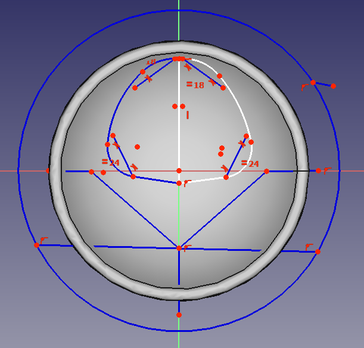

> FreeCad File: `Drafts/HeadSketch`

## Step 2: Revolving the Profile 🔄
1. **Switch to Part Design Workbench:**
   - Exit the Sketcher and switch to the **Part Design** workbench.

2. **Apply the Revolve Tool:**
   - Select the completed sketch in the Model Tree.
   - Click on **Revolve** in the toolbar.
   - Set the revolution axis as the vertical construction line from the sketch.
   - Choose **360 degrees** for the full revolution.

    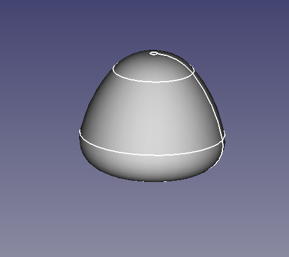

> FreeCad File: `Drafts/Revolve`

## Result

The 2D sketch is now a 3D solid representing Eva's head.

    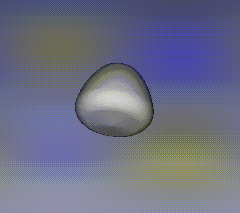

# Modeling Eva's Body in FreeCAD 🛠️

This section explains the process of designing Eva's body, starting with a spherical base that is deformed into an ovoid shape and using cutting and slicing operations to shape it into the desired form.

---

## Step 1: Creating the Spherical Base 🌐
1. **Insert a Sphere:**
   - Open the **Part Workbench**.
   - Insert a sphere using the **Create Primitive** tool.
   - Adjust the sphere's radius to roughly match the initial size of Eva's body.

    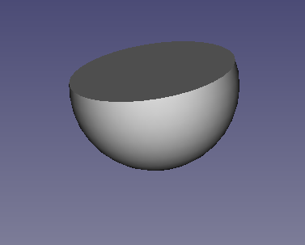

> FreeCad File: `Drafts/Sphere`

2. **Deform the Sphere into an Ovoid:**
   - Use the **Scale Tool** or adjust the properties of the sphere to stretch it along the Z-axis.
   - This creates the ovoid shape characteristic of Eva's body.

3. **Position the Ovoid Shape:**
   - Move the deformed sphere along the Z-axis to align it with the overall design.
   - Ensure it represents the main volume of the body.

    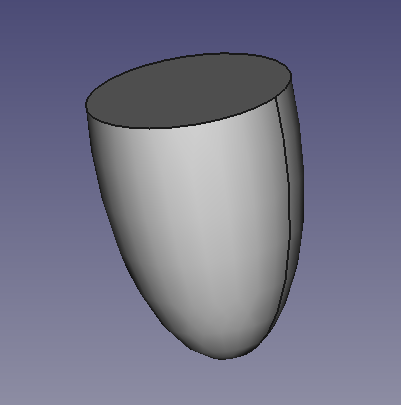

> FreeCad File: `Non-Sized-Parts/.../EvaBody/Body/Sphere001`

## Step 2: Shaping the Neck 🌀

1. **Build Other Sphere:**
   - Generate another sphere with the same radious
   - Locate the sphere at the neck.

2. **Perform a Boolean Cut:**
   - Use the **Boolean Difference Tool** to subtract the smaller ovoid from the larger one.

    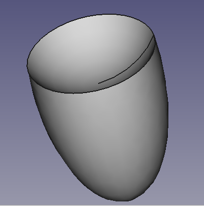

## Step 3: Shaping the Body ✂️
1. **Slice the Ovoid:**
   - Insert a rectangular **Cut Plane** using the **Part Workbench**.
   - Position the plane to remove the bottom portion of the ovoid, flattening the base.
   - Use the **Boolean Cut Tool** to perform the slice.

2. **Create the Arm Openings:**
   - Insert two smaller spheres to represent the arm sockets.
   - Position these spheres symmetrically on the sides of the hollow body.
   - Use the **Boolean Difference Tool** to cut the arm sockets out of the body.

    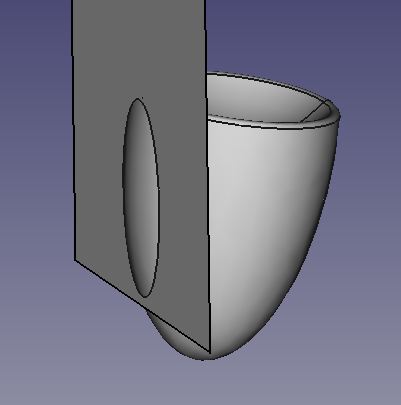

## Step 4: Refining the Model ✨
1. **Smooth the Edges:**
   - Apply the **Fillet Tool** to round any sharp edges left from the slicing and cutting operations.

2. **Validate the Design:**
   - Ensure all operations were performed correctly and the resulting body is symmetrical and smooth.

    

## Construction Tree Breakdown 🌳
| Step            | Operation         | Description                                |
|-----------------|-------------------|--------------------------------------------|
| `Sphere001`     | Create Sphere     | Main body volume                           |
| `Sphere002`     | Create Smaller Sphere | Inner cavity for hollowing the body       |
| `ArmCutLeft`    | Add Sphere        | Sphere positioned to cut left arm socket   |
| `ArmCut`        | Add Sphere        | Sphere positioned to cut right arm socket  |
| `Slice`         | Add Cut Plane     | Plane used to flatten the bottom           |
| `CuttedBody`    | Boolean Operations| Final body after all slicing and cutting   |

The body design is now ready for further detailing, such as attaching arms or adding internal mechanisms.

# Modeling Eva's Arms and Neck Connection in FreeCAD 🛠️

This section details the creation of Eva’s arms and the neck bridge structure that connects the head to the body.

## Step 1: Designing the Arms 🤖

### Right Arm:
1. **Create the Arm Shaft:**
   - Open the **Part Workbench**.
   - Insert a **Cylinder** to serve as the main shaft of the arm.
   - Adjust the radius and height to match Eva’s proportions.

2. **Combine the Shapes:**
   - Use the **Boolean Union Tool** to merge the cylinder and the elliptical end into a single arm structure.

### Left Arm:
1. **Duplicate the Right Arm:**
   - Use `Ctrl+C` and `Ctrl+V` to duplicate the right arm.
   - Mirror the duplicate using the **Transform Tool** to create a symmetrical left arm.
   - Position it on the opposite side of the body.

    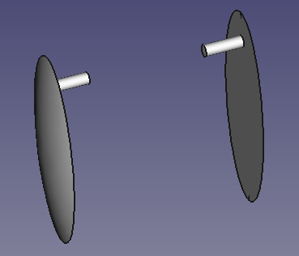

## Step 2: Creating the Neck Bridge 🌉

1. **Design the Bridge Cylinder:**
   - Insert a **Cylinder** to form the base of the neck bridge.
   - Adjust its dimensions to connect seamlessly between the head and body.

2. **Add the Circular Block:**
   - Switch to the **Sketcher Workbench** and draw a circle.
   - Extrude the circle using the **Part Workbench** to create a block at the top of the bridge cylinder.
   - Position the block so it aligns with the neck opening created in the body.

    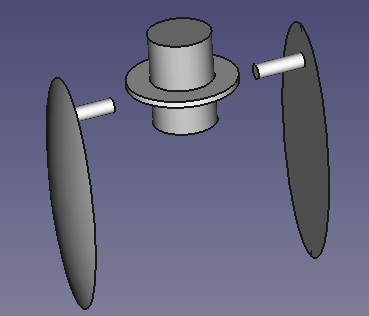

## Step 3: Assembling the Components 🧩
1. **Attach the Arms:**
   - Position the arms symmetrically on either side of the body.
   - Use the **Boolean Union Tool** to connect the arm supports to the body.

2. **Connect the Neck Bridge:**
   - Align the neck bridge with the hollow neck opening in the body.
   - Ensure it is centered and securely attached.

    

The arms and neck bridge provide the structure for Eva’s movement and connection between the head and body.

# Adding and Designing Eva's Base with FPGA Compatibility in FreeCAD 🛠️

This section details the steps to add a cylindrical base to Eva, hollow out the object for internal components, and design a base with fixations to securely fit an FPGA. A reference model of the FPGA was used to ensure precise compatibility.

## Step 1: Adding a Cylindrical Base
1. **Create the Base Cylinder:**
   - Open the **Part Workbench**.
   - Add a **Cylinder** primitive below Eva's body.
   - Adjust the radius and height to provide stability and proportionate support for the overall design.

2. **Position the Cylinder:**
   - Align the cylinder with the body’s central axis.
   - Ensure it extends slightly outward to serve as a sturdy base.

3. **Smooth the Edges:**
   - Use the **Fillet Tool** on the cylinder's top edge to create a smooth transition to the body.

    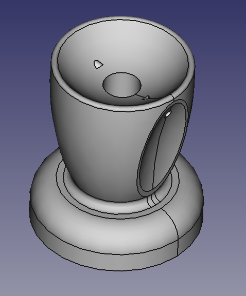

## Step 2: Hollowing the Object and Opening the Base
1. **Hollow the Main Body:**
   - Use the **Part Workbench** to insert a smaller internal cylinder.
   - Perform a **Boolean Cut** to subtract the smaller cylinder from the larger body, creating a hollow interior.

2. **Open the Base:**
   - Add another cylinder as a cutting tool to create an opening at the bottom of the base.
   - Align it with the base’s central axis and adjust its radius slightly smaller than the base’s outer diameter.
   - Perform a **Boolean Cut** to create a clean, circular opening at the base.

    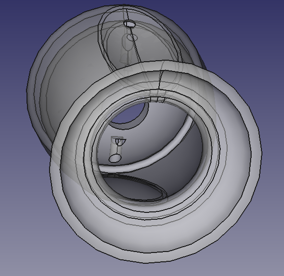

## Step 3: Designing the Base and FPGA Fixations
1. **Import the FPGA Reference Model:**
   - Download an STL or STEP file of the FPGA from an online library.
   - Import the model into FreeCAD using the **File > Import** option.

2. **Create Fixation Points:**
   - Use the **Sketcher Workbench** to draw mounting holes and supports for the FPGA.
   - Extrude the sketches to create solid pillars and slots that align with the FPGA’s mounting points.

3. **Integrate the Fixations with the Base:**
   - Use the **Part Design Workbench** to position the fixations inside the hollowed-out base.
   - Ensure proper alignment with the imported FPGA model.

    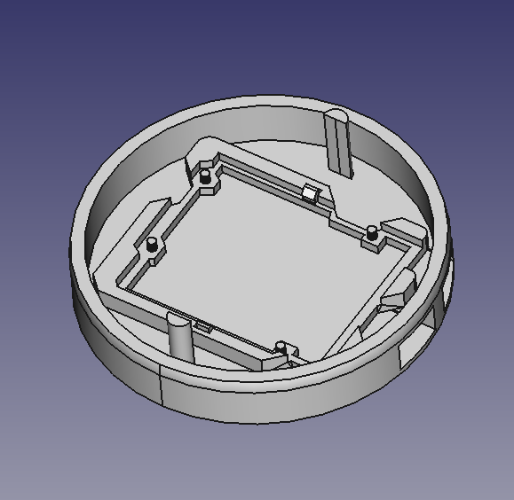

